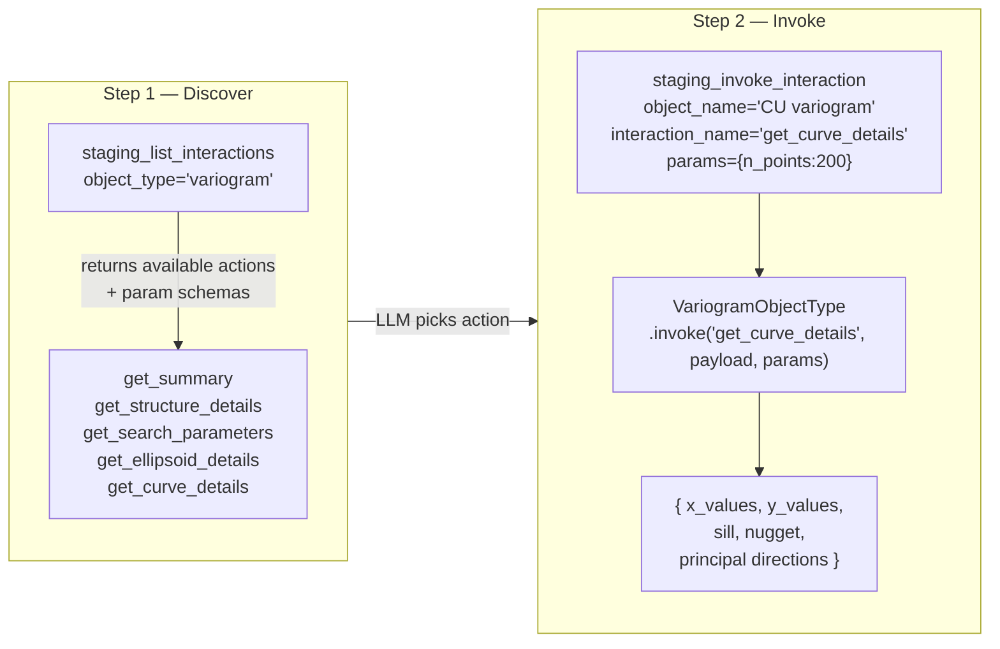

# The two-tool interaction pattern

Instead of one MCP tool per capability per type, **all domain actions go through two generic tools**.



---

## Adding a new capability

**It's not necessary to create a new MCP tool.** Instead, add one `Interaction` inside the object type module:

```python
self._register_interaction(Interaction(
    name="export_to_csv",
    display_name="Export to CSV",
    description="Serialise variogram to CSV-compatible dict.",
    handler=self._export_to_csv,
    params_model=ExportParams,   # optional — Pydantic schema auto-discovered by LLM
))
```