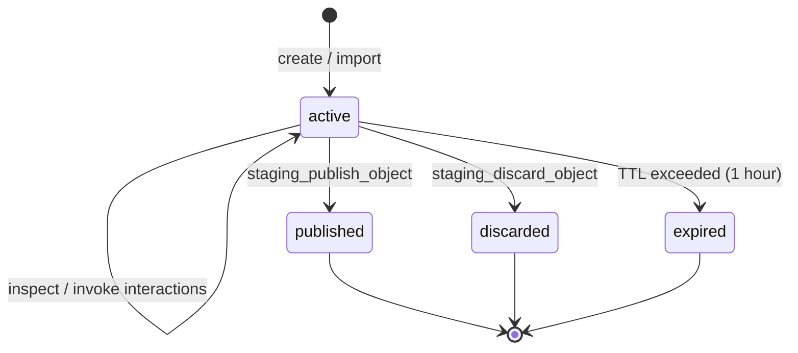
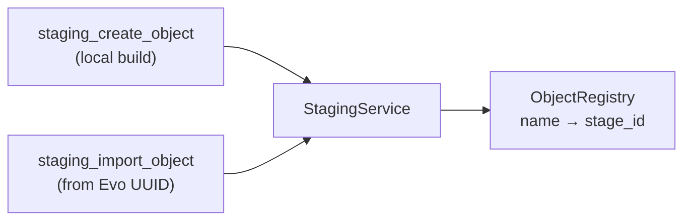
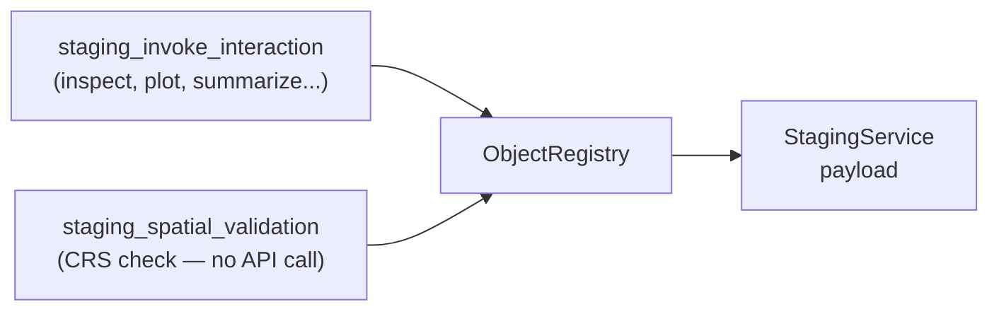
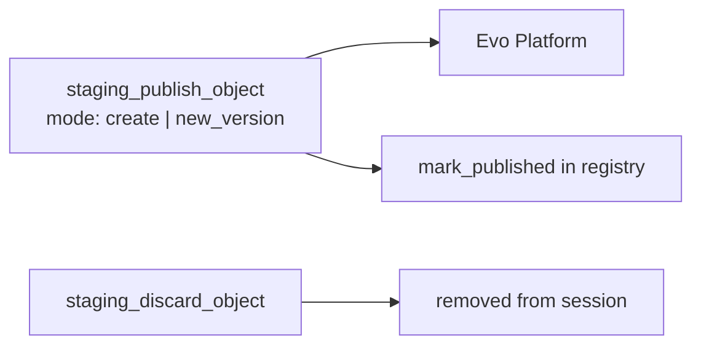

# Object Staging Lifecycle

## States

---

## Entry — Create or Import

- **Create:** Pydantic params validated → `StagedObjectType.create()` → staged locally
- **Import:** SDK object fetched from Evo → `import_handler()` converts to typed data → staged

---

## Use — Inspect / Validate

---

## Exit — Publish or Discard

