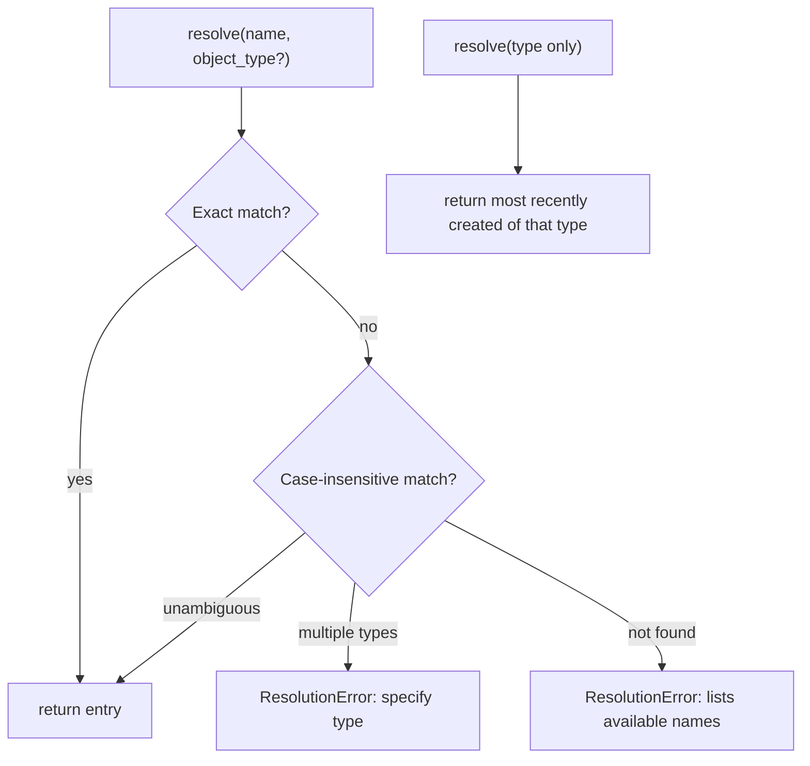

# Session Layer — `evo_mcp/session/`

Maps **human-readable names** to internal staged objects.
Tools register objects by name after creation; downstream tools look them up by name.

---

## Structure

```
session/
  models.py    RegistryEntry  (name, type, stage_id, status, summary)
  resolver.py  ObjectResolver (case-insensitive + latest-wins matching)
  registry.py  ObjectRegistry (module-level singleton)
```

---

## Name Resolution



---

## Key API

```python
# After staging:
object_registry.register(name="CU variogram", object_type="variogram", stage_id=...)

# In a downstream tool:
entry, payload = object_registry.get_payload("CU variogram")

# After publishing to Evo:
object_registry.mark_published(name="CU variogram", object_type="variogram", object_id="<evo-uuid>")
```

`object_registry` is a **module-level singleton** shared across all tool modules.
