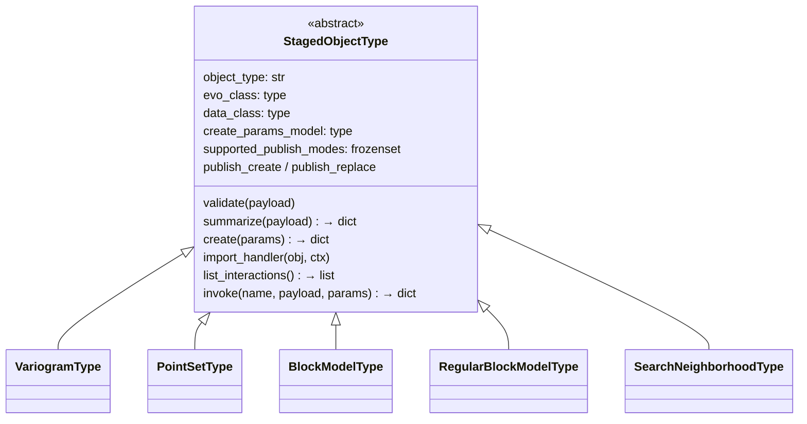

# Staging layer — `evo_mcp/staging/`

Typed, in-memory payload store with TTL, size guards, and a **plugin system** for object types.

> **Deployment constraint:** `StagingService` is an in-process, in-memory store.
> It is only suitable for single-process local deployments. All staged objects are
> lost on server restart, and concurrent processes each maintain their own isolated
> store with no shared state. To support a hosted or multi-process deployment, the
> `_envelopes` and `_payloads`` dicts in `service.py` must be replaced with a
> durable shared backend.

### Why a staging layer?

Without staging, object state must be carried in the conversation context window — object names, non-Evo parameters (e.g. variogram model choices, column mappings), and intermediate results all consume tokens and risk being lost across long sessions. Staging also reduces API interaction: a common pattern is import once then run multiple compute jobs or local interactions against the same object; without a local store each would re-fetch from the API each time.

---

## Structure

```
staging/
  service.py     StagingService — combined store + facade (singleton)
  models.py      StagedEnvelope — metadata (no payload exposed)
  errors.py      StageError hierarchy
  runtime.py     DI shim — breaks circular import with session/
  helpers.py     Shared Pydantic geometry schemas
  objects/
    base.py      StagedObjectType + Interaction + StagedObjectTypeRegistry
    variogram.py · point_set.py · block_model.py
    regular_block_model.py · search_neighborhood.py
```

---

## Plugin object type

Every object type is a self-registering subclass of `StagedObjectType`:



Adding a new object type = add one subclass file. No changes to tools needed.

---

## Circular import prevention

```mermaid
flowchart LR
    OBJ["staging.objects.*\n(needs session registry)"]
    RT["staging.runtime\n_registry = None\n← wired at startup"]
    SES["session.registry\n(imports staging.service)"]

    OBJ -->|get_registry()| RT
    RT -.->|configure() at startup| SES

    style RT fill:#fffbe6,stroke:#d4b800
```

`staging/runtime.py` is a leaf module — no runtime imports — preventing the
`staging.objects` ↔ `session.registry` circular dependency.
