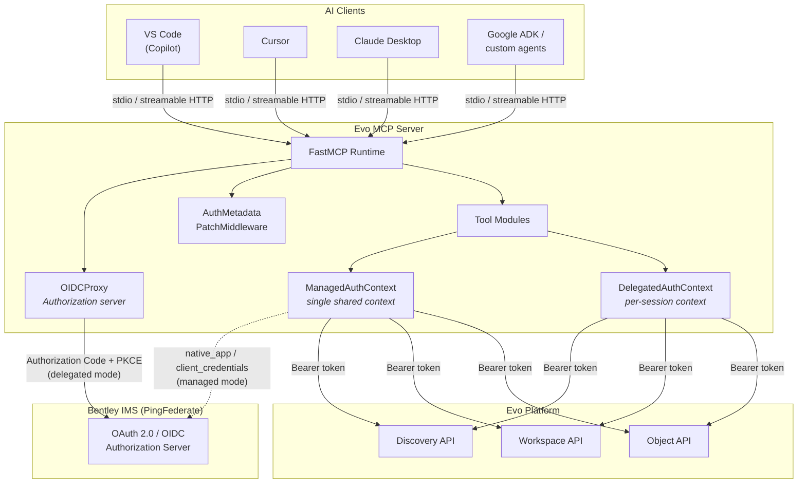
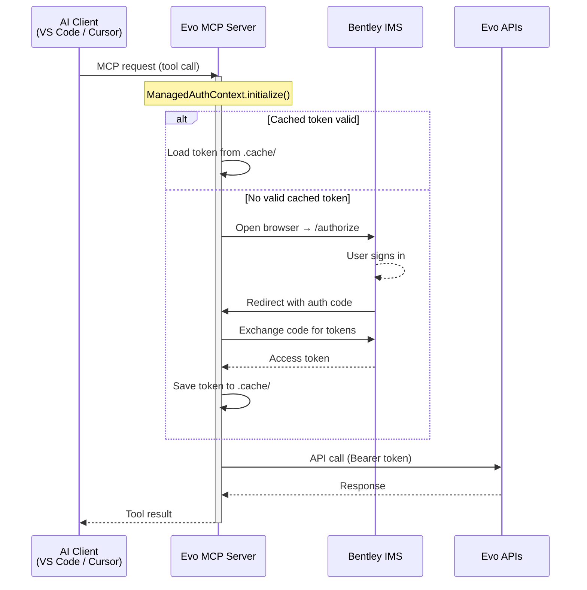
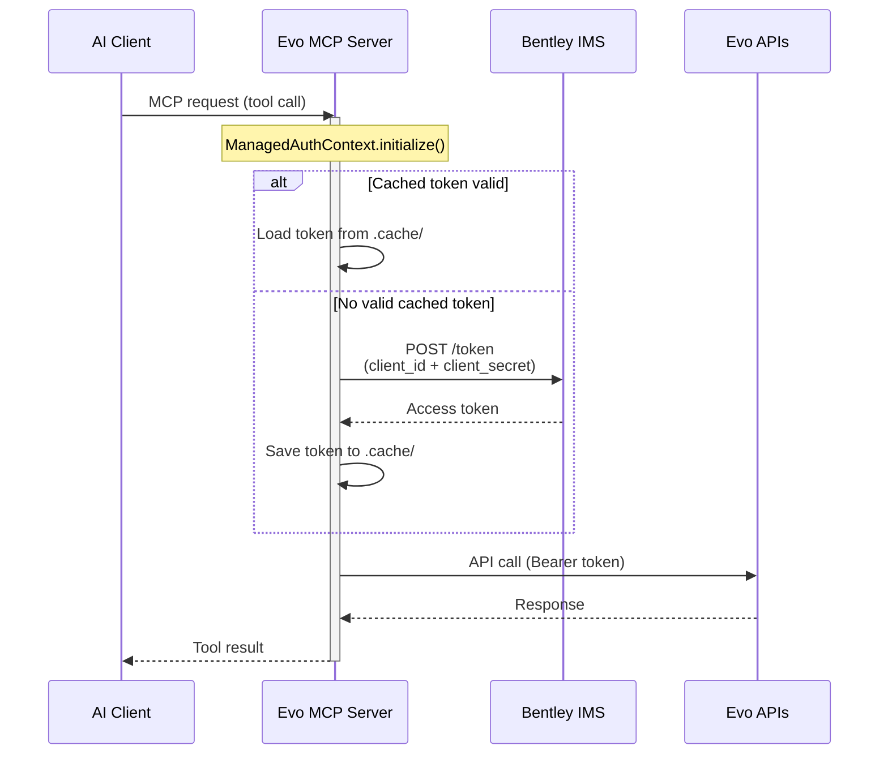
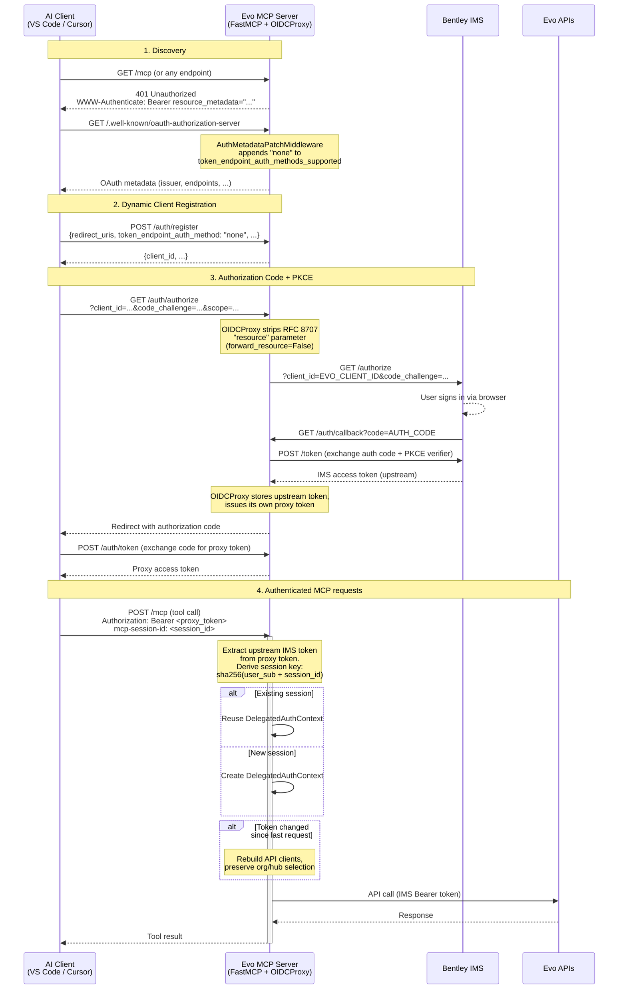
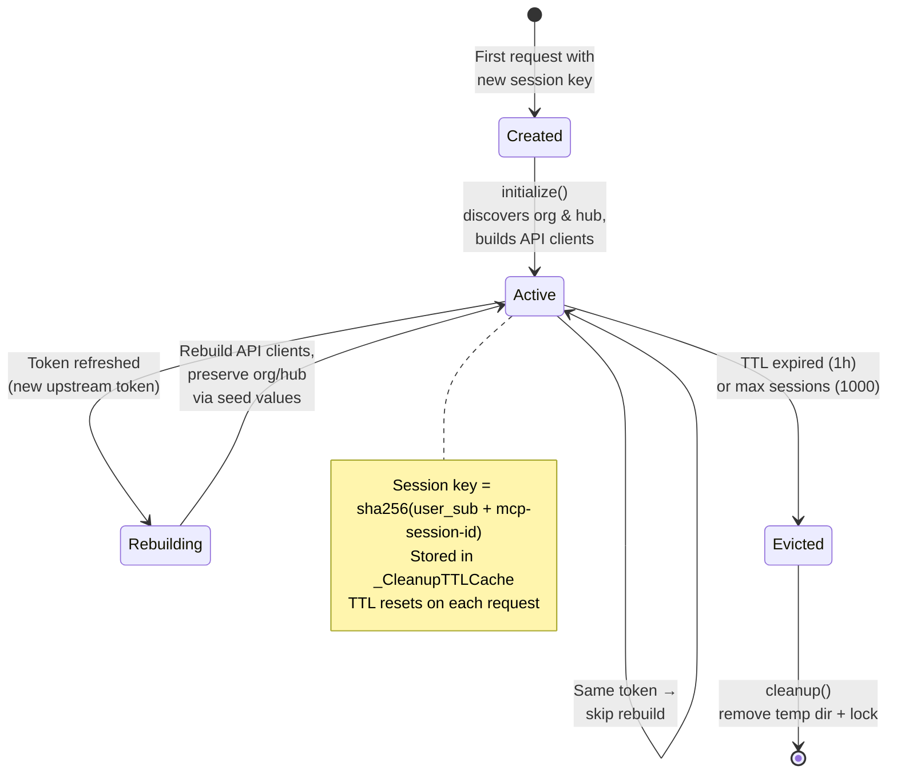

<!--
SPDX-FileCopyrightText: 2026 Bentley Systems, Incorporated

SPDX-License-Identifier: Apache-2.0
-->

# Authentication

The Evo MCP server supports two authentication modes depending on the deployment scenario. This document explains how each mode works, including the OAuth flows, session management, and current workarounds.

## Overview

| Mode | When to use | How it works |
|------|-------------|-------------|
| **Server-managed** | Local dev, single-user, STDIO or HTTP | The MCP server authenticates directly with Bentley IMS. All clients share one identity. |
| **Client-delegated** | Shared server, multi-user, HTTP only | Each AI client authenticates independently via OAuth. The MCP server acts as an authorization server using OIDCProxy. |

## Components



## Server-managed authentication

Used when `CLIENT_DELEGATED_AUTH=false` (the default). The MCP server handles authentication itself — either via an interactive browser login (`AUTH_METHOD=native_app`) or a service token (`AUTH_METHOD=client_credentials`).

All connecting AI clients share a single Evo identity and session. The token is cached to disk (`.cache/`) and survives server restarts.

### Sequence: native_app (interactive)



### Sequence: client_credentials (service)



## Client-delegated authentication

Used when `CLIENT_DELEGATED_AUTH=true` with `MCP_TRANSPORT=http`. Each AI client authenticates independently — the MCP server acts as an OAuth authorization server using FastMCP's [OIDCProxy](https://gofastmcp.com/servers/auth#oidcproxy).

OIDCProxy implements the MCP authorization specification:
- **Dynamic Client Registration (DCR)** — clients register themselves
- **Authorization Code + PKCE** — browser-based user authentication proxied to Bentley IMS
- **Token management** — OIDCProxy issues its own tokens backed by upstream IMS tokens

### Full OAuth flow



### Key design decisions

| Decision | Rationale |
|----------|-----------|
| `forward_resource=False` | MCP clients send RFC 8707 `resource` parameter. Bentley IMS rejects unknown resource URLs with `invalid_target`. OIDCProxy strips it before forwarding to IMS. |
| `token_endpoint_auth_method: "none"` | AI clients are public OAuth clients (no client secret). IMS native/SPA apps use PKCE only. |
| Fixed `/auth/callback` path | In HTTP mode, the MCP server itself receives the IMS OAuth callback (not the evo SDK's local server). The redirect URI is `{MCP_PUBLIC_BASE_URL}/auth/callback`. |
| Composite session key | `sha256(user_sub + mcp-session-id)` prevents session-ID spoofing — even with a forged header, the `sub` claim from the JWT differs per user. |

## Session lifecycle (delegated mode)

Each authenticated client gets its own `DelegatedAuthContext` managed by a `_CleanupTTLCache`.



### Session identity

The session key is derived from two values:

1. **`sub` claim** from the IMS JWT — identifies the user
2. **`mcp-session-id` header** — identifies the client session (set by MCP protocol)

```
session_key = sha256(user_sub + ":" + mcp_session_id)[:32]
```

If the `mcp-session-id` header is absent (fallback), the raw token is used instead — but this means a token refresh creates a new session (the old one is evicted by TTL).

### Eviction and cleanup

`_CleanupTTLCache` (subclass of `cachetools.TTLCache`) ensures prompt cleanup:

| Trigger | What happens |
|---------|-------------|
| **TTL expiry** (default: 1 hour since last access) | Context evicted on next cache operation |
| **Max size exceeded** (default: 1000 sessions) | Least-recently-used context evicted |
| **Eviction hook** | `cleanup()` called → removes temp directory; matching `session_locks` entry removed |

## Current workarounds

These patches work around upstream issues and should be removed when fixes are released.

### 1. AuthMetadataPatchMiddleware

**Problem:** The MCP Python SDK's `build_metadata()` hardcodes `token_endpoint_auth_methods_supported` to `["client_secret_post", "client_secret_basic"]`. Public clients need `"none"`.

**Workaround:** ASGI middleware intercepts `GET /.well-known/oauth-authorization-server` and appends `"none"` to the list.

**Remove when:** `mcp` SDK includes `"none"` natively in `build_metadata()`.
**Tracking:** [python-sdk#2260](https://github.com/modelcontextprotocol/python-sdk/issues/2260)

### 2. forward_resource=False

**Problem:** MCP clients send an RFC 8707 `resource` parameter (the MCP server URL). Bentley IMS has its own resource model and rejects unknown resource URLs with `invalid_target`.

**Workaround:** `OIDCProxy(forward_resource=False)` strips the parameter before forwarding to IMS.

**Remove when:** This is likely permanent for Bentley IMS deployments, since IMS does not support arbitrary RFC 8707 resource indicators. However, the `forward_resource` parameter was added upstream specifically for this use case.
**Tracking:** [fastmcp#3939](https://github.com/PrefectHQ/fastmcp/issues/3939)
