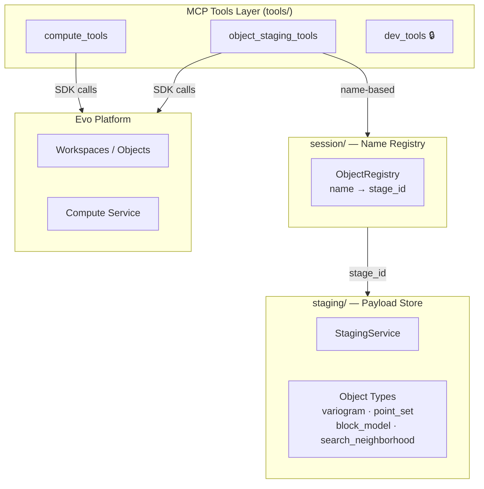

# Estimation workflow design

End-to-end design for how an estimation workflow (e.g. kriging) is orchestrated
across **MCP Tools → Session → Staging → Evo**. Covers the key layers,
their responsibilities, and the design decisions that connect them.

## Workflow stack



---

## Core principle

> Users and LLMs always work with **object names** — never internal IDs, stage IDs, or tool mechanics.

```
User: "inspect my CU variogram"
  → ObjectRegistry.resolve("CU variogram")
  → StagingService.get_stage_payload(stage_id)
  → StagedObjectType.invoke("summarize", payload)
  → plain-language result
```

---

## Key design decisions

| Decision | Why |
|---|---|
| Name-based registry over raw IDs | LLMs/users work in geoscience language, not UUIDs |
| Plugin object types (self-registering) | Add a new type without touching tool code |
| Two-tool interaction pattern | Capabilities are discoverable, not hard-coded |
