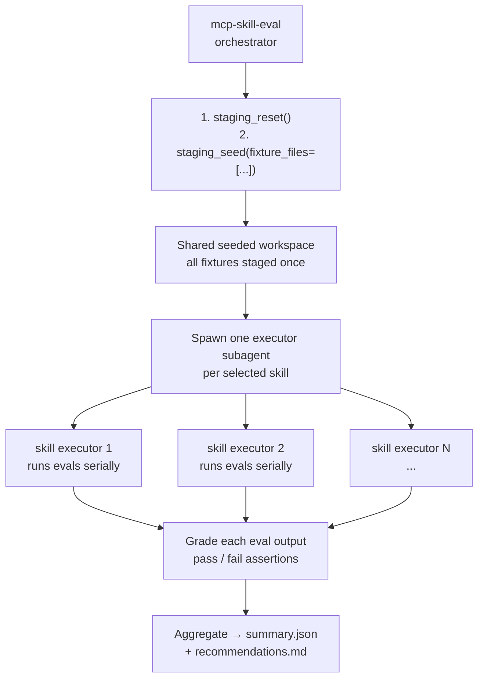

# Skill Evaluations — `skills-dev/mcp-skill-eval/`

The eval harness validates that skills produce correct outputs against known fixtures.
It lives in `skills-dev/` — not shipped with the server.

---

## Structure

```
skills-dev/
  mcp-skill-eval/
    SKILL.md                   ← eval orchestrator skill (LLM-driven)
    references/
      templates.md             ← executor prompt template
      schemas.md               ← JSON schemas for output files
    skill-evals/
      <skill-name>/
        fixtures.json          ← objects to seed before running evals
        evals.json             ← eval prompts + expected outputs
```

---

## How an Eval Run Works



---

## Eval Definition

Each entry in `evals.json` is a natural-language prompt + expected outcome:

```json
{
  "id": 1,
  "prompt": "Create a spherical variogram with sill=1.0, nugget=0.1, major=200...",
  "expected_output": "Variogram created. Search params reflect 2x scaling: major=400...",
  "category": "happy-path-local-workflow"
}
```

---

## Fixtures

`fixtures.json` seeds pre-built objects so evals start from a known state.
Seed modes: `staged` (local only, fast), `workspace` (published to Evo), `both`.

---

## Output Layout

```
skills-eval-workspace/
  iteration-N/
    summary.json           ← pass/fail counts across all skills
    recommendations.md     ← prioritized actionable fixes
    <skill-name>/
      timing.json          ← token + duration metrics
      eval-<id>/
        grading.json       ← per-eval pass/fail with evidence
```

Prior iterations are kept — never deleted — to support regression tracking.

---

## Skills with Evals

| Skill | Has fixtures? | Eval categories |
|---|---|---|
| `manage-variogram` | ✓ | happy-path, multi-structure, error-handling, visualisation |
| `manage-search-neighborhood` | ✓ | explicit ranges, variogram-derived, presets, error-handling |
| `manage-block-model` | ✓ | local design, structure details |
| `manage-point-set` | ✓ (CSV files) | CSV load, attribute stats, invalid data |
| `evo-kriging-execute` | ✓ | single scenario, multi-scenario |
| `kriging-reporting` | ✓ | result interpretation, scenario comparison |
| `kriging-workflow` | ✓ | end-to-end orchestration |
| `evo-object-discovery` | ✓ | find by name, by type |
| `evo-object-visualisation` | ✓ | link generation |
| `staging-workflow` | ✓ | import, publish, discard |
| `validate-crs` | ✓ | compatible, mismatch, unknown |
