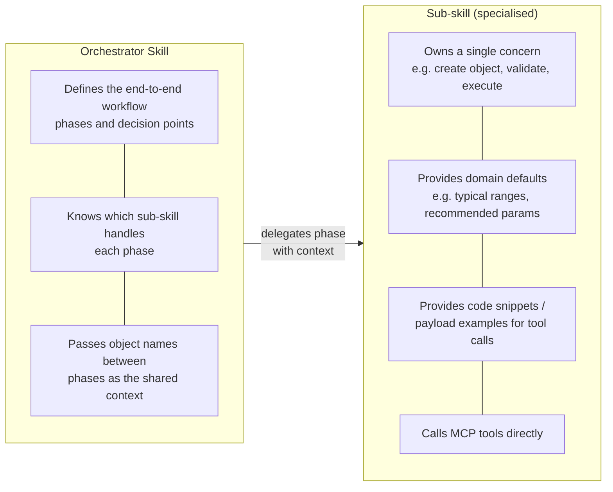
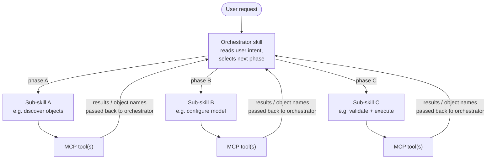
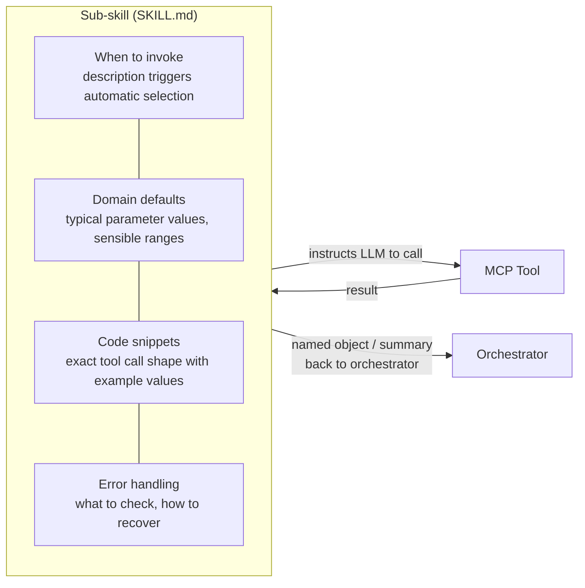

# Skills — `skills/`

Skills are **Markdown guides** that tell an LLM how to use MCP tools to complete
end-to-end workflows. They encode domain knowledge and workflow logic separately
from the tools themselves.

---

## What a Skill Is

```
skills/<skill-name>/
  SKILL.md          ← LLM instruction guide (frontmatter: name, description)
  references/       ← supplementary detail loaded on-demand
    payload_contract.md
    tool_call_reference.md
    ...
```

The `description` frontmatter field is used by the LLM to decide **when to invoke**
the skill. Skills are loaded via FastMCP's `SkillsDirectoryProvider`.

---

## Two Kinds of Skill



---

## How an Orchestrator Delegates



---

## What a Sub-skill Contributes



---

## Skill Inventory

| Skill | Type | Role |
|---|---|---|
| `kriging-workflow` | **Orchestrator** | End-to-end workflow: data → results |
| `evo-object-discovery` | Sub-skill | Find objects in Evo by name/type |
| `staging-workflow` | Sub-skill | Import, inspect, update, publish staged objects |
| `manage-variogram` | Sub-skill | Create and inspect variograms locally |
| `manage-search-neighborhood` | Sub-skill | Design search neighborhoods |
| `manage-block-model` | Sub-skill | Design block models from extents |
| `manage-point-set` | Sub-skill | Load point sets from CSV |
| `validate-crs` | Sub-skill | Check CRS compatibility between staged objects |
| `evo-kriging-execute` | Sub-skill | Execute kriging with resolved published inputs |
| `kriging-reporting` | Sub-skill | Interpret and summarize kriging results |
| `evo-object-visualisation` | Sub-skill | Generate viewer/portal links |

---

## Syncing Skills to Clients

The `sync_skills` tool copies skills from `skills/` to the platform-specific
skills directory (Copilot, Claude, Cursor, etc.) so chat clients can discover them.

```python
sync_skills(target_platform="copilot", skills=["kriging-workflow", "manage-variogram"])
```
