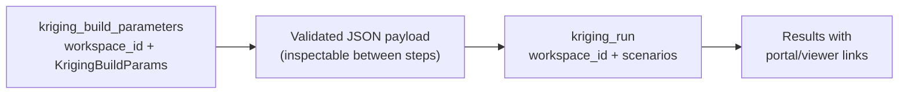

# Compute Tools — `tools/compute_tools.py`

Kriging is deliberately **two steps** so the LLM (or user) can inspect and adjust
configuration before execution.



---

## `kriging_build_parameters`

Resolves source, target, and variogram from Evo (parallel), then produces a
validated `KrigingParameters` JSON payload:

```
point_set_object_id + point_set_attribute
variogram_object_id
target_object_id   + target_attribute
search (ellipsoid + sample counts)
method (ordinary | simple)
region filter, block discretisation (optional)
```

---

## `kriging_run`

Accepts one or more `KrigingParameters` payloads and runs them in parallel.
Progress is bridged from the SDK's `IFeedback` → FastMCP `ctx.report_progress()`.

Returns per-scenario: target name, attribute created/updated, portal + viewer links.

---

## Why Two Steps?

- LLM can summarize inputs to the user for confirmation before execution
- Multi-scenario runs: build N payloads, review, then run in one batch
- Separates Evo object resolution (build) from compute submission (run)
