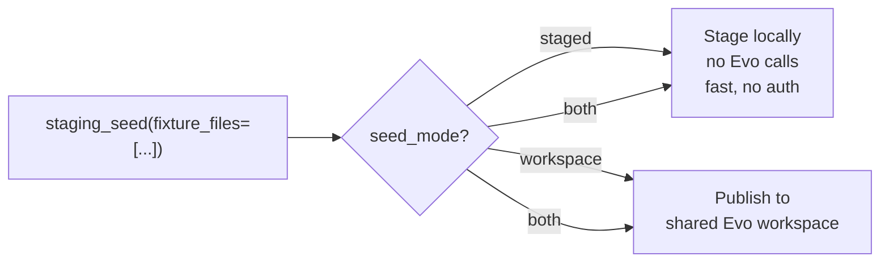

# Dev Tools — `tools/dev_tools.py`

Gated behind `MCP_DEV_MODE=true`. Not exposed in production.

| Tool | Purpose |
|---|---|
| `staging_get_info` | Inspect a stage envelope by ID |
| `staging_clone` | Clone a stage for experimentation |
| `staging_gc` | Garbage-collect expired/discarded stages |
| `staging_seed` | Seed fixture JSON files into the session |
| `staging_reset` | Wipe all staged objects — clean slate for evals |

---

## Fixture Seeding

| Mode | Use case |
|---|---|
| `staged` | Unit tests, fast evals — no auth needed |
| `workspace` | Integration tests needing real Evo UUIDs |
| `both` | Tests that chain cloud IDs with session lookups |

`staging_reset()` clears the registry and all payloads — always run before eval iterations.
